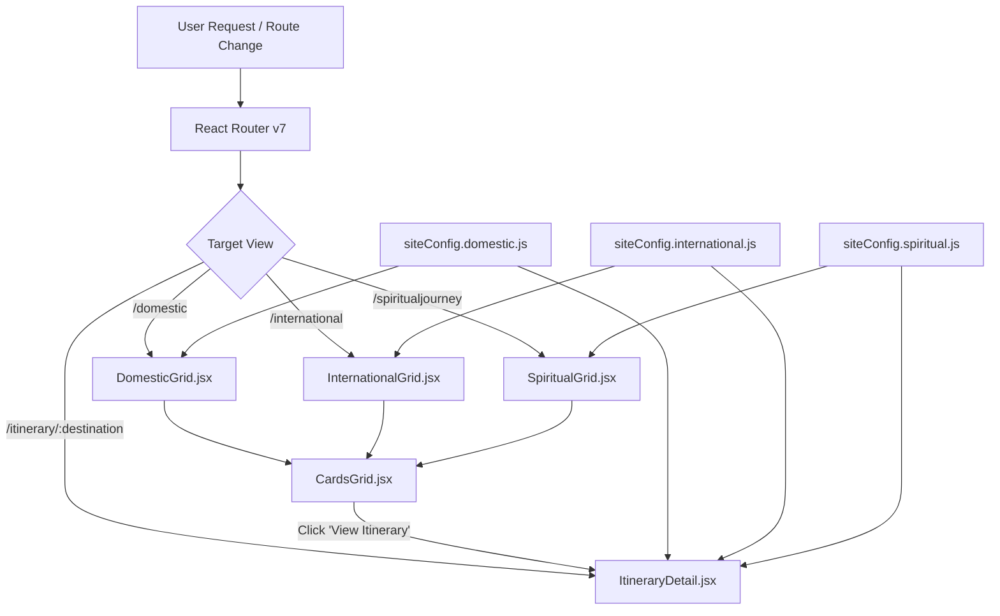

# Yugatirtha Architecture & Code Structure

This document provides a comprehensive breakdown of the project architecture, directory tree, routing logic, component hierarchy, and data management layer.

---

## 1. Technology Stack

- **Core Framework**: React 19 (`react` & `react-dom` v19.2)
- **Build Tool**: Vite 8 (ESM, ultra-fast bundling and HMR)
- **Routing**: React Router v7 (`react-router-dom` v7.18)
- **Styling**: Tailwind CSS v4 (`@tailwindcss/postcss` v4.3) with custom CSS design tokens
- **Animations**: Framer Motion v13 (`framer-motion`)
- **Icons**: Lucide React (`lucide-react`)
- **Interactive Geolocation**: Custom SVG polygon-based interactive India region map

---

## 2. Directory Tree Overview

```text
sacred-travel/
├── public/
│   ├── assets/                 # Optimized images for hero, domestic, intl & spiritual journeys
│   │   ├── hero-spiti.jpg
│   │   ├── hero-aarti.jpg
│   │   ├── hero-himalaya-Ben1uNJZ.jpg
│   │   ├── indiaRegionMap.png
│   │   └── ...
│   └── favicon.svg
├── src/
│   ├── components/             # Reusable UI & section components
│   │   ├── domestic/           # Domestic journey components
│   │   │   ├── CardsGrid.jsx
│   │   │   ├── DomesticGrid.jsx
│   │   │   └── RegionalBanner.jsx
│   │   ├── experiences/        # Experiential travel components
│   │   │   └── ExperiencesGrid.jsx
│   │   ├── home/               # Homepage specific components
│   │   │   ├── EnquiryForm.jsx
│   │   │   ├── HeroCarousel.jsx
│   │   │   ├── HomeGrid.jsx
│   │   │   ├── StatsStrip.jsx
│   │   │   └── Testimonials.jsx
│   │   ├── international/      # International journey components
│   │   │   ├── CardsGrid.jsx
│   │   │   ├── InternationalGrid.jsx
│   │   │   └── RegionalBanner.jsx
│   │   ├── spiritualjourney/   # Consecrated journey components
│   │   │   ├── EastDirection.jsx
│   │   │   ├── NorthDirection.jsx
│   │   │   ├── SouthDirection.jsx
│   │   │   ├── SpiritualCardsGrid.jsx
│   │   │   ├── SpiritualGrid.jsx
│   │   │   ├── SpiritualRegionalBanner.jsx
│   │   │   └── WestDirection.jsx
│   │   ├── Footer.jsx          # Multi-column site footer & directory
│   │   ├── IndiaMap.jsx        # Responsive interactive SVG polygon map
│   │   ├── Navbar.jsx          # Glassmorphism navigation & drawer
│   │   └── ScrollToTop.jsx     # Route transition scroll restoration
│   ├── data/                   # Central & modular data configuration
│   │   ├── siteConfig.js               # Global site data, nav & umbrella re-export
│   │   ├── siteConfig.domestic.js      # Domestic itineraries (8 destinations, 22 circuits)
│   │   ├── siteConfig.international.js # International itineraries (6 destinations, 12 circuits)
│   │   └── siteConfig.spiritual.js     # Consecrated itineraries (8 regions, 20 circuits)
│   ├── pages/                  # Top-level view routes
│   │   ├── About.jsx           # Brand story, philosophy & founders
│   │   ├── Contact.jsx         # Inquiries, address, direct WhatsApp links
│   │   ├── Domestic.jsx        # Domestic destinations view
│   │   ├── Experiences.jsx     # Signature sacred & cultural moments
│   │   ├── Home.jsx            # Landing page
│   │   ├── International.jsx   # International journeys view
│   │   ├── ItineraryDetail.jsx # Dynamic detail page for all circuits
│   │   └── SpiritualJourney.jsx# Consecrated four directions page
│   ├── App.jsx                 # Route definitions & app layout wrapper
│   ├── index.css               # Tailwind v4 theme definitions, typography & utilities
│   └── main.jsx                # Application bootstrap entry point
├── index.html                  # HTML entry point with Google Fonts preloads
├── package.json                # Project dependencies and npm scripts
└── vite.config.js              # Vite configuration with React plugin
```

---

## 3. Core Architectural Layers

### A. Routing Architecture (`src/App.jsx`)
The application uses declarative routing with `react-router-dom`:

| Route Path | Page Component | Description |
|---|---|---|
| `/` | `Home.jsx` | Landing page featuring hero carousel, gateways, stats, testimonials & quick inquiry |
| `/domestic` | `Domestic.jsx` | Regional exploration across North, Northeast, West & South India |
| `/international` | `International.jsx` | International circuits (Southeast Asia, East & South Asia, CIS, Middle East) |
| `/spiritualjourney` | `SpiritualJourney.jsx` | Cardinal sacred directions (North, South, East, West) + interactive map |
| `/experiences` | `Experiences.jsx` | Curated moments (abhishekam rituals, high-altitude passes, ancient crafts) |
| `/about` | `About.jsx` | Story of Yugatirtha, founding principles & slow travel ethos |
| `/contact` | `Contact.jsx` | Direct communication, custom trip planner, WhatsApp hotline |
| `/itinerary/:destination` | `ItineraryDetail.jsx` | Unified dynamic detail view for all 22+ destinations and 54+ packages |

Global wrappers mounted across all pages:
- `<ScrollToTop />`: Listens to route changes (`useLocation`) and scrolls smoothly to window `(0, 0)`.
- `<Navbar />`: Fixed sticky navigation with glassmorphism blur and mobile overlay drawer.
- `<Footer />`: Comprehensive directory linking destinations, cardinal pilgrimages, legal details.
- Floating WhatsApp Widget: Quick-contact floating trigger linking directly to WhatsApp API (`wa.me/918591262424`).

---

### B. Modular Data Layer (`src/data/`)

To prevent multi-thousand-line monolithic config files and merge conflicts, itinerary data is divided into domain-specific modules:

```text
src/data/
├── siteConfig.domestic.js       ── Exports `domesticSiteConfig`
├── siteConfig.international.js  ── Exports `internationalSiteConfig`
├── siteConfig.spiritual.js      ── Exports `spiritualSiteConfig`
└── siteConfig.js                ── Re-exports modules & defines category cards
```

#### Data Schema per Itinerary Package
Each itinerary in `itineraries[slug]` contains an array of package variations:
```javascript
{
  id: "kashmir-1",                       // Unique ID string
  title: "Kashmir",                     // Destination name
  duration: "Kashmir 4N/5D",             // Formatted standard duration
  inclusions: [                         // Bulleted list of inclusions
    "Accommodation for 4 Nights on a Double Sharing Basis...",
    "Internal transfer to Aru Valley, Betaab Valley and Chandanwari",
    "Gondola Cable car phase 1 tickets",
  ],
  days: [                               // Day-by-day structured itinerary
    {
      title: "Day 1 - Arrival in Srinagar. Local Sightseeing.",
      activities: [
        "Arrive at Srinagar Airport and meet our representative.",
        "Proceed for local sightseeing covering Mughal Gardens.",
        "Overnight stay in Srinagar."
      ]
    },
    ...
  ]
}
```

#### Destination Slugs Catalog:
1. **Domestic (`siteConfig.domestic.js`)**:
   - `kashmir` (4N/5D, 5N/6D, 6N/7D)
   - `ladakh` (5N/6D, 6N/7D, 7N/8D)
   - `himachal` (4N/5D, 5N/6D, 5N/6D, 8N/9D)
   - `spiti` (6N/7D, 7N/8D, 8N/9D)
   - `meghalaya` (4N/5D, 5N/6D, 6N/7D)
   - `sikkim` (4N/5D, 5N/6D, 6N/7D)
   - `arunachal` (4N/5D, 5N/6D, 6N/7D)
   - `rajasthan` (6N/7D, 7N/8D, 9N/10D)

2. **International (`siteConfig.international.js`)**:
   - `bali` (5N/6D, 5N/6D Yoga)
   - `japan` (7N/8D, 8N/9D)
   - `srilanka` (5N/6D, 5N/6D Ella & Trincomalee)
   - `philippines` (7N/8D, 6N/7D)
   - `georgia` (5N/6D, 6N/7D)
   - `vietnam` (6N/7D, 7N/8D)

3. **Spiritual Journeys (`siteConfig.spiritual.js`)**:
   - `uttarakhand` (Do Dham 5N/6D, Char Dham 9N/10D, Kainchi Dham 2N/3D, Badrinath 4N/5D)
   - `uttarpradesh` (Varanasi-Ayodhya 4N/5D, Kashi 2N/3D, Kashi-Prayagraj-Ayodhya 4N/5D)
   - `madhyapradesh` (Bhasma Aarti Special 2N/3D, VIP Passes 2N/3D)
   - `maharashtra` (Pune 2N/3D, Pune 3N/4D, Mumbai 3N/4D)
   - `gujarat` (Gujarat Jyotirling 3N/4D)
   - `odisha` (Puri Dham 4N/5D, Puri Konark 3N/4D)
   - `tamilnadu` (Rameswaram 4N/5D, Pancha Bhoota Stalam 6N/7D)
   - `andhrapradesh` (Mallikarjun 3N/4D, Tirupati 2N/3D, Tirupati with Kalahasti 2N/3D)

---

### C. Itinerary Detail View System (`src/pages/ItineraryDetail.jsx`)

When a user visits `/itinerary/:destination`:
1. `useParams()` extracts the `:destination` slug (e.g. `spiti`, `vietnam`, `uttarakhand`).
2. Checks against `domesticSiteConfig`, `internationalSiteConfig`, and `spiritualSiteConfig`.
3. Selects package circuits dynamically via a sticky sub-tab bar (`packages.map(...)`).
4. Renders:
   - **Hero Header**: High-resolution image, destination badge, breadcrumb navigation, and page title.
   - **Circuit Duration Switcher**: Allows selecting between multiple options (e.g., 5N/6D vs 7N/8D).
   - **Day Timeline**: Interactive accordion showing day numbers, titles, and itemized daily activities.
   - **Sticky Booking Card**: Displays duration, tour highlights, confirmed WhatsApp booking button, and telephone consultation.
   - **Inclusions & Highlights**: Structured grid of everything provided.

---

### D. Interactive India Map (`src/components/IndiaMap.jsx`)

- Uses SVG polygon coordinates mapped over a custom India map asset (`/assets/indiaRegionMap.png`).
- Quadrants:
  - **North**: Uttarakhand, Himachal, Kashmir, Ladakh, UP.
  - **West**: Gujarat, Maharashtra, Rajasthan, MP.
  - **South**: Tamil Nadu, Andhra Pradesh, Karnataka, Kerala.
  - **East**: Odisha, Assam, Meghalaya, West Bengal.
- Clicking any quadrant triggers `onRegionClick(quadrant)`, which smoothly scrolls the page to the respective direction container (`#north`, `#west`, etc.) and selects the active highlight.

---

## 4. State Management and Data Flow



---

## 5. Build, Lint & Development Workflow

- **Development Server**: `npm run dev` (running on `localhost:5173`)
- **Production Bundle**: `npm run build` (`vite build`)
- **Linter**: `npm run lint` (`oxlint`)
- **Preview Production Build**: `npm run preview`
